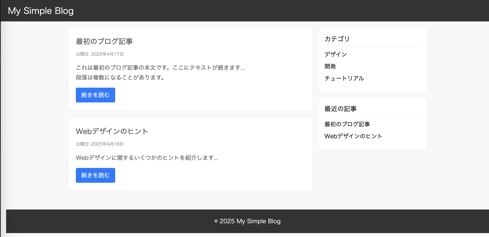
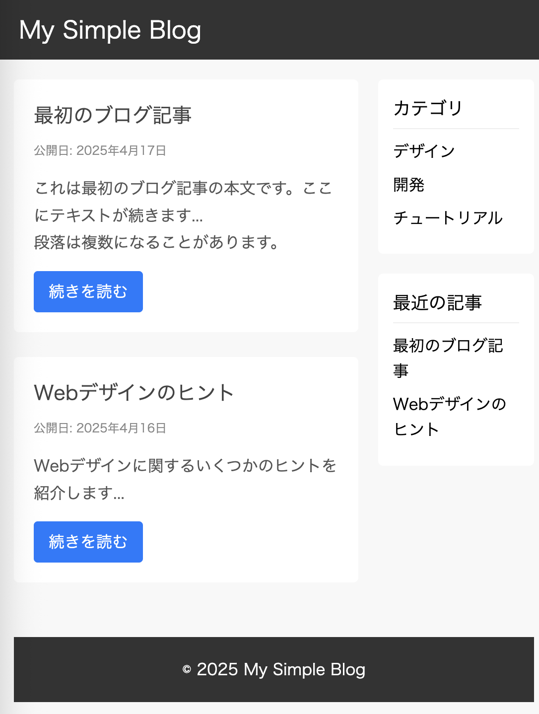

# ブログ記事ページのスタイルシート実装

* HTML ファイル (`blog.html`) はすでに作成されたものが渡されます。
* `reset.css` に基本的なスタイルが実装されています。
* 以下の仕様に従い、`style.css` にCSSを記述してください。
* 具体的なイメージは、完成図を参照してください。

## 完成図

## リポジトリのファイル構成

* `blog.html`: スタイリング対象のHTMLファイルです。 **編集は不要です。**
* `reset.css`: 基本的なリセットCSSです。 **編集は不要です。**
* `style.css`: **このファイルにCSSを記述して実装を進めてください。**
* `README.md`: このファイルです。依頼内容詳細が記載されています。
* (参考) `solution.css`: 解答例のCSSファイルです。

## 仕様スタイル

### `body` タグ

* 内側の余白 (`padding`): 上下 `0`, 左右 `15px`

### `#page-header`

* 高さ (`height`): `60px`
* 背景色 (`background-color`): `#333333`
* 文字色 (`color`): `#FFFFFF`
* 内側の余白 (`padding`): 上下 `0`, 左右 `20px`
* 位置 (`position`): `fixed` (固定)
    * 上 (`top`): `0`
    * 左 (`left`): `0`
    * 右 (`right`): `0`
* 重なり順 (`z-index`): `100`

### `#page-header h1`

* フォントサイズ (`font-size`): `24px`
* 行の高さ (`line-height`): `60px`

### `#main-container`

* 最大幅 (`max-width`): `1000px`
* 左右の外側余白 (`margin`): `auto` (中央揃え)
* 上の外側余白 (`margin-top`): `80px`
* レイアウト (`display`): `flex`

### `#content`

* 幅 (`width`): `70%`
* 右の内側余白 (`padding-right`): `20px`

### `#sidebar`

* 幅 (`width`): `30%`

### `article.blog-post`

* 背景色 (`background-color`): `#FFFFFF`
* 内側の余白 (`padding`): `20px`
* 下の外側余白 (`margin-bottom`): `25px`
* 角の丸み (`border-radius`): `5px`

### `.post-title`

* フォントサイズ (`font-size`): `20px`
* 下の外側余白 (`margin-bottom`): `10px`
* 文字色 (`color`): `#444444`

### `.post-meta`

* フォントサイズ (`font-size`): `12px`
* 文字色 (`color`): `#888888`
* 下の外側余白 (`margin-bottom`): `15px`

### `.post-content`

* 文字色 (`color`): `#555555`
* 行の高さ (`line-height`): `1.7`

### `.read-more-link`

* 表示 (`display`): `inline-block`
* 背景色 (`background-color`): `#007bff`
* 文字色 (`color`): `#FFFFFF`
* 内側の余白 (`padding`): 上下 `8px`, 左右 `15px`
* 文字装飾 (`text-decoration`): `none`
* 角の丸み (`border-radius`): `4px`
* 上の外側余白 (`margin-top`): `15px`

### `.read-more-link:hover`

* 背景色 (`background-color`): `#0056b3`

### `.widget`

* 背景色 (`background-color`): `#FFFFFF`
* 内側の余白 (`padding`): `15px`
* 下の外側余白 (`margin-bottom`): `20px`
* 角の丸み (`border-radius`): `5px`

### `.widget-title`

* フォントサイズ (`font-size`): `18px`
* 下の外側余白 (`margin-bottom`): `10px`
* 下境界線 (`border-bottom`): `1px solid #EEEEEE`
* 境界線の下の余白 (`padding-bottom`): `5px`

### `.widget ul li`

* 下の外側余白 (`margin-bottom`): `8px`

### `.widget ul li a:hover`

* 文字装飾 (`text-decoration`): `underline`

### `#page-footer`

* 背景色 (`background-color`): `#333333`
* 文字色 (`color`): `#FFFFFF`
* 内側の余白 (`padding`): 上下 `20px`, 左右 `0`
* 上の外側余白 (`margin-top`): `30px`
* テキストの水平位置 (`text-align`): `center`
